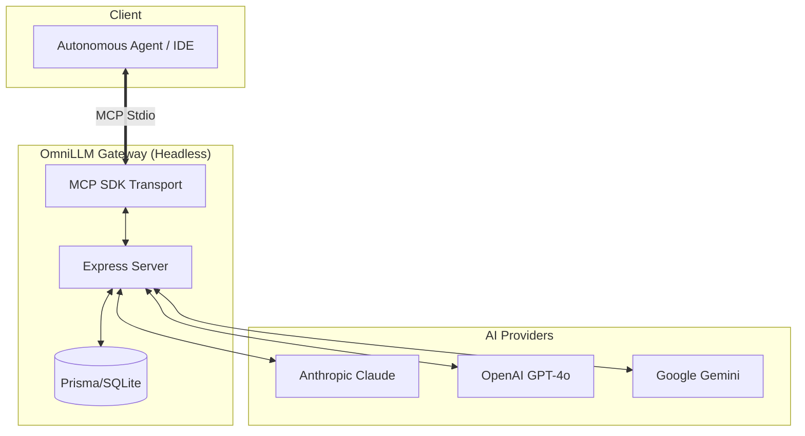

# OmniLLM Gateway 🚀

<div align="center">

[](https://opensource.org/licenses/MIT)
[](https://nodejs.org/)
[](https://www.typescriptlang.org/)
[](https://www.prisma.io/)

**A high-performance, headless MCP Gateway connecting AI agents to Claude, GPT-4o, and Gemini — optimized for speed and reliability.**

</div>

---

## 🎯 Overview

**OmniLLM** is a production-grade [Model Context Protocol](https://modelcontextprotocol.io/) server that connects autonomous agents (like Google Antigravity) to elite LLM providers. 

Following a major optimization, OmniLLM is now a **headless gateway**. All dashboard overhead and real-time UI emissions have been removed to ensure zero-latency token throughput and maximum reliability for agentic workflows.

> [!IMPORTANT]
> **Dashboard Removed**: This server no longer runs a UI. It is designed to be used as a background service by MCP clients.

---

## ⚡ Quick Start

### 1. Installation
```bash
git clone https://github.com/ManiDeep1822/OmniLLM.git
cd OmniLLM
npm install
```

### 2. Configuration
Create a `.env` file from the example:
```bash
cp .env.example .env
```
Add your `GEMINI_API_KEY`, `CLAUDE_API_KEY`, or `OPENAI_API_KEY`.

### 3. Database & Launch
```bash
npx prisma migrate dev --name init
npm run dev
```

---

## 🌟 Features

| Feature | Description |
|---|---|
| 🚀 **Zero-Overhead Streaming** | Pure token streaming directly to your MCP client without UI latency |
| 🚦 **Auto-Router** | Dynamically selects the best model based on task complexity |
| ⛓️ **Context Chaining** | Persistent multi-turn memory backed by SQLite |
| 🤖 **Multi-Step Chains** | Executes sequential prompts with incremental result delivery |
| ⚖️ **Model Comparison** | Benchmarks responses from multiple providers simultaneously |
| 🛡️ **MCP Stability** | Optimized timeouts and heartbeat pings for long-running agent tasks |
| 💰 **Logging & Costs** | Local DB logging of all calls for audit and cost estimation |

---

## 🏗️ Architecture



---

## 🔧 Antigravity / MCP Configuration

Add this to your `mcp_config.json`:

```json
{
  "mcpServers": {
    "llm-gateway": {
      "command": "node",
      "args": ["C:/absolute/path/to/OmniLLM/dist/server.js"],
      "env": {
        "GEMINI_API_KEY": "YOUR_KEY_HERE",
        "CLAUDE_API_KEY": "YOUR_KEY_HERE",
        "OPENAI_API_KEY": "YOUR_KEY_HERE"
      }
    }
  }
}
```

---

## 🛠️ Available MCP Tools

- `stream-generate`: Standard text generation with streaming.
- `auto-router`: Automatically picks the best provider/model for the task.
- `multi-step-chain`: Executes sequential prompts with context passing.
- `model-comparison`: Benchmarks Claude, GPT-4o, and Gemini in parallel.
- `context-chain`: Maintains persistent conversation memory.

---

## 🛡️ Troubleshooting

| Issue | Solution |
| :--- | :--- |
| **Tools not showing** | Ensure `dist/server.js` path in config uses forward slashes `/`. |
| **Fallback to Simulation** | *Removed in v1.2.0*. You will now see real errors if API keys are missing. |
| **`Failed to parse stream`** | Check your API key and model quota in AI Studio / Anthropic Console. |
| **`EOF` Connection Drop** | Ensure you are running the latest v1.2.0+ which has optimized heartbeat pings. |

---

## 📄 License

This project is licensed under the **MIT License**.

<div align="center">
  <sub>Built with ❤️ by <a href="https://github.com/ManiDeep1822">Indla Mohana Venkata Mani Deep</a></sub>
</div>
