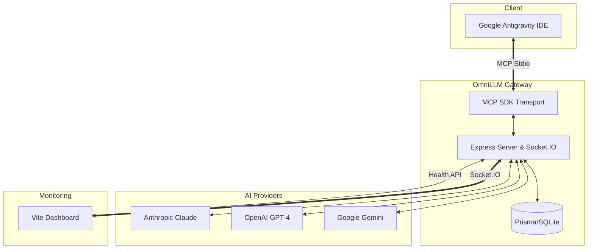
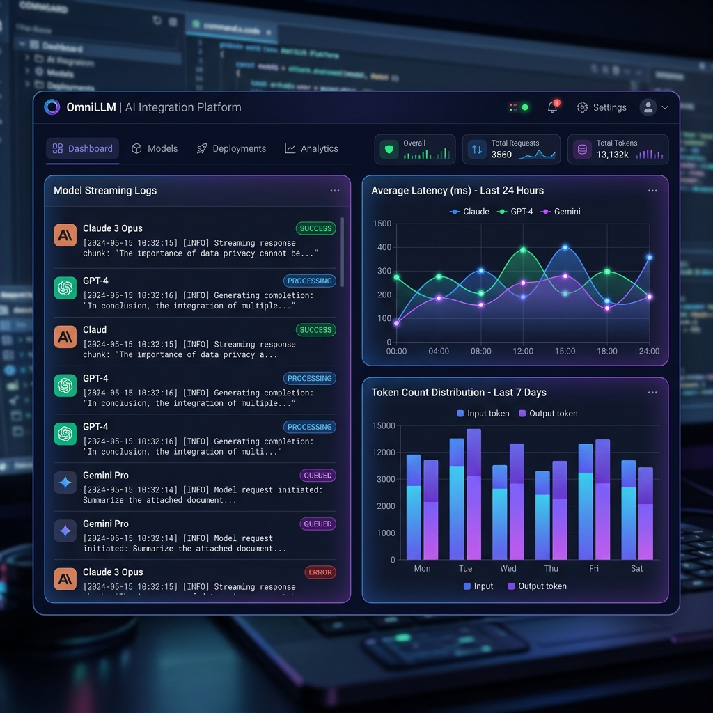

# OmniLLM Gateway 🚀

<div align="center">

[](https://opensource.org/licenses/MIT)
[](https://nodejs.org/)
[](https://www.typescriptlang.org/)
[](https://react.dev/)
[](https://socket.io/)
[](https://www.prisma.io/)

**A production-grade MCP Gateway connecting Google Antigravity to Claude, GPT-4o, and Gemini — with a real-time monitoring dashboard.**

</div>

---

## 🎯 Overview

**OmniLLM** is a production-grade [Model Context Protocol](https://modelcontextprotocol.io/) server that connects the Google Antigravity IDE (and any MCP-compatible client) to elite LLM providers including Anthropic Claude, OpenAI GPT-4o, and Google Gemini.

It features a robust multi-model routing system with **Gemma 4 27B** as the default high-performance engine for Google Gemini tasks, persistent context chaining via SQLite, and a high-fidelity glassmorphic dashboard with live token streaming and custom-tuned ergonomics.

> [!TIP]
> **Working with Agents?** Check out [AGENTS.md](AGENTS.md) for optimized operation patterns and model selection strategies for autonomous agents like Antigravity.

---

## ⚡ Quick Start (3 Commands)

### Linux / macOS (Bash/Zsh)
```bash
# 1. Clone and install
git clone https://github.com/ManiDeep1822/OmniLLM.git
cd OmniLLM && npm install && cd dashboard-ui && npm install && cd ..

# 2. Configure environment
cp .env.example .env

# 3. Initialize DB and launch
npx prisma migrate dev --name init && npm run dev:all
```

### Windows (PowerShell)
```powershell
# 1. Clone and install
git clone https://github.com/ManiDeep1822/OmniLLM.git
cd OmniLLM; npm install; cd dashboard-ui; npm install; cd ..

# 2. Configure environment
Copy-Item .env.example .env

# 3. Initialize DB and launch
npx prisma migrate dev --name init; npm run dev:all
```

> Starts the MCP server on port `3000` and the dashboard on port `5173` simultaneously.

---

## 🌟 Features

| Feature | Description |
|---|---|
| ⚡ **Real-time Streaming** | Full token-by-token streaming to the dashboard and IDE |
| 🚦 **Auto-Router** | Dynamically selects the best model based on task complexity |
| ⛓️ **Context Chaining** | Persistent multi-turn memory backed by SQLite |
| 📊 **Premium Dashboard** | Glassmorphic Vite/React UI with custom-tuned scrollbars and real-time feeds |
| 🤖 **Multi-Step Chains** | Executes sequential prompts with **incremental result streaming** and progress tracking |
| ⚖️ **Model Comparison** | Benchmarks responses from all three providers simultaneously |
| 🛡️ **MCP Stability** | Connection-alive pings and optimized timeouts for long-running tasks |
| 💰 **Cost Tracking** | Per-request token counting and cost estimation |
| 🏥 **Provider Health** | Real-time latency and uptime monitoring per provider |

## 🏗️ Architecture



## 🎥 Demo



Experience real-time token streaming and automated context chaining directly in your browser while your IDE manages the logic.

## 🚀 Quick Start

Fastest way to get up and running:

**Linux / macOS:**
```bash
npm install && npx prisma migrate dev --name init && cp .env.example .env && npm run dev:all
```

**Windows (PowerShell):**
```powershell
npm install; npx prisma migrate dev --name init; Copy-Item .env.example .env; npm run dev:all
```

---

## 📋 Prerequisites

- **Node.js** 18.0.0 or higher
- **IDE**: Google Antigravity or any MCP-compatible client
- **API Keys**: Anthropic, OpenAI, and Google Gemini

---

## ⚙️ Installation

1. **Clone the repository**:
   ```bash
   git clone https://github.com/ManiDeep1822/OmniLLM.git
   cd OmniLLM
   ```

2. **Install all dependencies**:
   **Linux / macOS:**
   ```bash
   npm install && cd dashboard-ui && npm install && cd ..
   ```
   **Windows (PowerShell):**
   ```powershell
   npm install; cd dashboard-ui; npm install; cd ..
   ```

3. **Configure Environment**:
   **Linux / macOS:**
   ```bash
   cp .env.example .env
   ```
   **Windows (PowerShell):**
   ```powershell
   Copy-Item .env.example .env
   ```

4. **Initialize Database**:
   ```bash
   npx prisma migrate dev --name init
   ```

5. **Build the MCP server**:
   ```bash
   npm run build
   ```

---

## 🔧 Antigravity Configuration

Update your `mcp_config.json` (located at `C:\Users\<you>\.gemini\antigravity\mcp_config.json`):

```json
{
  "mcpServers": {
    "llm-gateway": {
      "command": "node",
      "args": ["C:/absolute/path/to/OmniLLM/dist/server.js"],
      "env": {
        "GEMINI_API_KEY": "YOUR_KEY_HERE",
        "GEMINI_MODEL": "gemma-4-27b-it",
        "CLAUDE_API_KEY": "YOUR_KEY_HERE",
        "OPENAI_API_KEY": "YOUR_KEY_HERE",
        "DATABASE_URL": "file:./prisma/dev.db"
      }
    }
  }
}
```

---

## 🛠️ Available MCP Tools

| Tool | Description |
|---|---|
| `stream-generate` | Standard text generation with real-time token streaming |
| `auto-router` | Dynamically selects the best provider/model for the task |
| `multi-step-chain` | Executes sequential prompts with context passing between steps |
| `model-comparison` | Generates responses from Claude, GPT-4o, and Gemini in parallel |
| `context-chain` | Maintains persistent conversation memory across sessions |

---

## 📊 Dashboard

The monitoring dashboard provides live visibility into all gateway traffic.

| Endpoint | URL |
|---|---|
| Dashboard UI | `http://localhost:5173` |
| Gateway REST API | `http://localhost:3000` |
| Health Check | `http://localhost:3000/api/health` |
| Call History | `http://localhost:3000/api/history` |
| Provider Health | `http://localhost:3000/api/providers/health` |
| Usage Analytics | `http://localhost:3000/api/analytics` |

**Run the dashboard:**
```bash
cd dashboard-ui
npm run dev
```

## 🛠️ Tech Stack

- **Backend**: Node.js, TypeScript, Express, Socket.IO, Prisma, SQLite
- **Frontend**: React, Vite, Tailwind CSS, Framer Motion, Recharts
- **MCP**: Model Context Protocol SDK

## 🗺️ Roadmap

- [ ] **Local LLMs**: Add support for Ollama and LocalAI.
- [ ] **Security**: Add authentication and JWT protection to the dashboard.
- [ ] **Observability**: Add cost budget alerts and rate limiting per provider.
- [ ] **Models**: Native support for Claude 3.5 Sonnet and GPT-4o.
- [ ] **Deployment**: Docker support for one-click deployment.

---

## 🛡️ Troubleshooting

| Issue | Solution |
| :--- | :--- |
| **Tools not showing in IDE** | Ensure `dist/server.js` path in `mcp_config.json` uses forward slashes `/`. |
| **`Failed to parse stream`** | Your Google API Key has expired. Get a new one from [AI Studio](https://aistudio.google.com/). |
| **Port 3000 already in use** | **Windows:** `netstat -ano \| findstr :3000` <br> **Linux/macOS:** `lsof -i :3000` |
| **`EPERM` during migration** | Close any process using the database file (including the dashboard). |
| **Dashboard shows no live data** | Ensure `npm run dev:all` is running; the dashboard relies on the Socket.IO server. |
| **`EOF` Connection Drop** | Fixed in v1.1.0+ via progress pings and increased server timeouts (300s). |

---

## ⚡ Stability & Reliability

OmniLLM is engineered for long-running autonomous workflows. To prevent connection drops during complex reasoning chains:
- **Progress Pings**: The server emits heartbeat events during multi-step operations to maintain the connection.
- **Incremental Streaming**: The `multi-step-chain` tool now streams results step-by-step rather than waiting for completion.
- **Protocol Isolation**: All logging is routed to `STDERR` to keep `STDOUT` reserved for clean JSON-RPC communication.
- **Extended Timeouts**: HTTP and keep-alive timeouts are set to 5 minutes by default.

---

## 🤝 Contributing

We welcome contributions! Please see [CONTRIBUTING.md](CONTRIBUTING.md) for details on our development workflow, code style, and pull request process.

---

## 📄 License

This project is licensed under the **MIT License** — see the [LICENSE](LICENSE) file for details.

---

<div align="center">
  <sub>Built with ❤️ by <a href="https://github.com/ManiDeep1822">Indla Mohana Venkata Mani Deep</a> — Powered by the Google Antigravity platform</sub>
</div>
