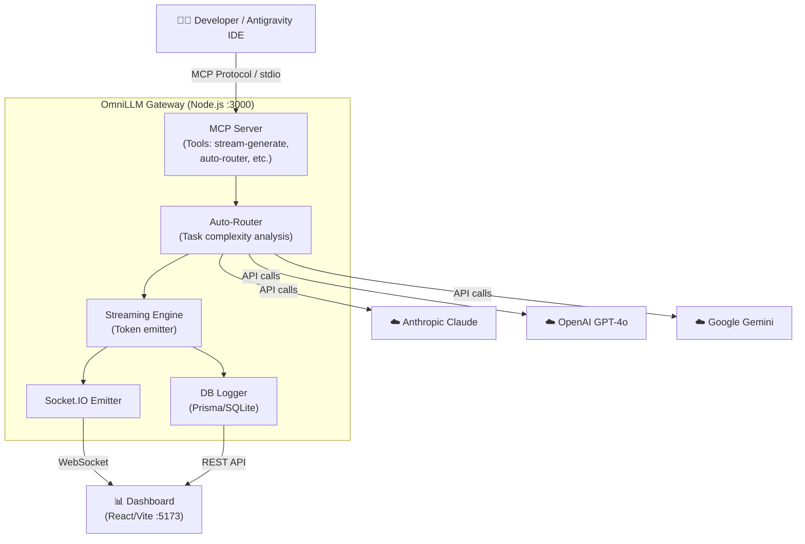

# OmniLLM Gateway 🚀

<div align="center">

[](https://opensource.org/licenses/MIT)
[](https://nodejs.org/)
[](https://www.typescriptlang.org/)
[](https://react.dev/)
[](https://socket.io/)
[](https://www.prisma.io/)

**A production-grade MCP Gateway connecting Google Antigravity to Claude, GPT-4o, and Gemini — with a real-time monitoring dashboard.**

</div>

---

## 🎯 Overview

**OmniLLM** is a production-grade [Model Context Protocol](https://modelcontextprotocol.io/) server that connects the Google Antigravity IDE (and any MCP-compatible client) to elite LLM providers including Anthropic Claude, OpenAI GPT-4o, and Google Gemini.

It features a robust multi-model routing system, persistent context chaining via SQLite, and a glassmorphic real-time monitoring dashboard with live token streaming.

---

## ⚡ Quick Start (3 Commands)

```bash
# 1. Clone and install
git clone https://github.com/ManiDeep1822/OmniLLM.git
cd OmniLLM && npm install && cd dashboard-ui && npm install && cd ..

# 2. Configure environment
cp .env.example .env   # Add your API keys to .env

# 3. Initialize DB and launch everything
npx prisma migrate dev --name init && npm run dev:all
```

> Starts the MCP server on port `3000` and the dashboard on port `5173` simultaneously.

---

## 🌟 Features

| Feature | Description |
|---|---|
| ⚡ **Real-time Streaming** | Full token-by-token streaming to the dashboard and IDE |
| 🚦 **Auto-Router** | Dynamically selects the best model based on task complexity |
| ⛓️ **Context Chaining** | Persistent multi-turn memory backed by SQLite |
| 📊 **Live Dashboard** | Glassmorphic Vite/React UI with real-time Socket.IO feeds |
| 🤖 **Multi-Step Chains** | Sequential reasoning with automated context passing |
| ⚖️ **Model Comparison** | Benchmarks responses from all three providers simultaneously |
| 💰 **Cost Tracking** | Per-request token counting and cost estimation |
| 🏥 **Provider Health** | Real-time latency and uptime monitoring per provider |

---

## 🏗️ Architecture



---

## 📋 Prerequisites

- **Node.js** 18.0.0 or higher
- **IDE**: Google Antigravity or any MCP-compatible client
- **API Keys**: Anthropic, OpenAI, and Google Gemini

---

## ⚙️ Installation

1. **Clone the repository**:
   ```bash
   git clone https://github.com/ManiDeep1822/OmniLLM.git
   cd OmniLLM
   ```

2. **Install all dependencies**:
   ```bash
   npm install
   cd dashboard-ui && npm install && cd ..
   ```

3. **Configure Environment**:
   ```bash
   cp .env.example .env
   # Edit .env and add your API keys
   ```

4. **Initialize Database**:
   ```bash
   npx prisma migrate dev --name init
   ```

5. **Build the MCP server**:
   ```bash
   npm run build
   ```

---

## 🔧 Antigravity Configuration

Update your `mcp_config.json` (located at `C:\Users\<you>\.gemini\antigravity\mcp_config.json`):

```json
{
  "mcpServers": {
    "llm-gateway": {
      "command": "node",
      "args": ["C:/absolute/path/to/OmniLLM/dist/server.js"],
      "env": {
        "GEMINI_API_KEY": "YOUR_KEY_HERE",
        "CLAUDE_API_KEY": "YOUR_KEY_HERE",
        "OPENAI_API_KEY": "YOUR_KEY_HERE",
        "DATABASE_URL": "file:./prisma/dev.db"
      }
    }
  }
}
```

---

## 🛠️ Available MCP Tools

| Tool | Description |
|---|---|
| `stream-generate` | Standard text generation with real-time token streaming |
| `auto-router` | Dynamically selects the best provider/model for the task |
| `multi-step-chain` | Executes sequential prompts with context passing between steps |
| `model-comparison` | Generates responses from Claude, GPT-4o, and Gemini in parallel |
| `context-chain` | Maintains persistent conversation memory across sessions |

---

## 📊 Dashboard

The monitoring dashboard provides live visibility into all gateway traffic.

| Endpoint | URL |
|---|---|
| Dashboard UI | `http://localhost:5173` |
| Gateway REST API | `http://localhost:3000` |
| Health Check | `http://localhost:3000/api/health` |
| Call History | `http://localhost:3000/api/history` |
| Provider Health | `http://localhost:3000/api/providers/health` |
| Usage Analytics | `http://localhost:3000/api/analytics` |

**Run the dashboard:**
```bash
# Both MCP server + dashboard (recommended)
npm run dev:all

# Dashboard only
npm run ui:dev
```

---

## 🗺️ Roadmap

- [x] Real-time token streaming via Socket.IO
- [x] Auto-router for dynamic model selection
- [x] Multi-step reasoning chains
- [x] Cost estimation and token counting
- [x] Provider health monitoring
- [x] Live dashboard with glassmorphic UI
- [ ] Ollama / local model support
- [ ] JWT-based authentication for the dashboard
- [ ] Prompt caching layer (Redis)
- [ ] Webhook support for stream completions
- [ ] Docker & Docker Compose setup
- [ ] Rate limiting and quota management per provider

---

## 🔧 Troubleshooting

| Problem | Likely Cause | Fix |
|---|---|---|
| `Cannot connect to MCP server` | Server not built or wrong path in mcp_config | Run `npm run build` and verify the absolute path in `args` |
| Dashboard shows "OFFLINE" | MCP server not running on port 3000 | Run `npm run dev` in the project root |
| `API key invalid` error | Missing or wrong key in `.env` | Double-check your `.env` file against `.env.example` |
| `Prisma error: table not found` | Database not initialized | Run `npx prisma migrate dev --name init` |
| Port 5173 already in use | Another Vite instance is running | Kill it with `npx kill-port 5173` or Vite will auto-increment |
| Port 3000 already in use | Another process on port 3000 | Change `PORT=3001` in `.env` and update the dashboard API URL |
| Live feed shows no data | Socket.IO connection blocked | Ensure browser allows `ws://127.0.0.1:3000` WebSocket connections |
| Build fails with TS errors | Type mismatch | Run `npm run build 2>&1` to see the full error list |

---

## 🤝 Contributing

We welcome contributions! Please see [CONTRIBUTING.md](CONTRIBUTING.md) for details on our development workflow, code style, and pull request process.

---

## 📄 License

This project is licensed under the **MIT License** — see the [LICENSE](LICENSE) file for details.

---

<div align="center">
  <sub>Built with ❤️ by <a href="https://github.com/ManiDeep1822">Indla Mohana Venkata Mani Deep</a> — Powered by the Google Antigravity platform</sub>
</div>
